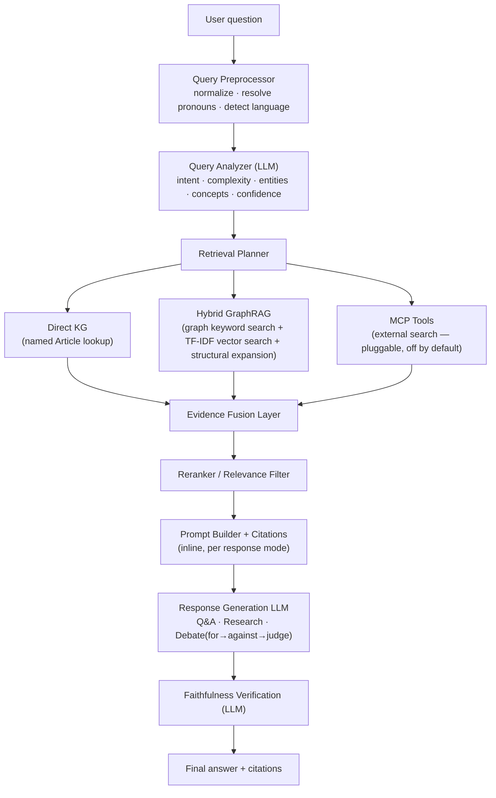

# ⚖️ ConstiGraph

**A graph-RAG, multi-agent assistant for the Constitution of India** — built with a knowledge graph, [LangGraph](https://github.com/langchain-ai/langgraph) agents, the [Groq Cloud](https://console.groq.com) LLM API, and Streamlit.

Most legal/document RAG demos chunk text, embed it into a vector store, and call it done. ConstiGraph instead runs a full retrieval pipeline: **query analysis → retrieval planning → three parallel retrieval branches → evidence fusion → reranking → grounded generation → faithfulness verification** — with the Constitution's real structure (**Part → Article → Clause → Subclause**) kept as an explicit graph throughout, so every answer traces back to a specific, citable node.

> Educational project — not legal advice.

---

## Architecture



Each retrieval branch is a real, independent LangGraph node that runs every turn; branches that the planner didn't select simply return no evidence, rather than being skipped outright — this keeps the fan-out/fan-in shape reliable under LangGraph's execution model while still making each branch's decision fully inspectable (the UI shows you exactly which branches ran and why, per question).

---

## Why this is interesting

- **A real retrieval *pipeline*, not a single search call.** Query analysis decides intent/complexity/confidence; the planner picks retrieval strategies from that; three independent branches retrieve in parallel; fusion merges and deduplicates; a reranker does a final relevance pass — each stage is a separate, testable, inspectable LangGraph node.
- **Hybrid retrieval, honestly scoped.** "Direct KG lookup" does exact article traversal. "Hybrid GraphRAG" combines IDF-weighted keyword search over the graph with a local TF-IDF vector index (a genuine, dependency-light stand-in for a hosted vector DB — see `src/vector_index.py` for the documented upgrade path to real embeddings). "MCP Tools" is a pluggable external-search adapter that ships **disabled by default** rather than pretending to have live internet access it doesn't.
- **Faithfulness verification as its own stage.** After an answer is drafted, a separate LLM call checks whether its citations and claims are actually backed by the retrieved evidence, and flags the answer in the UI if not — a second, independent check rather than trusting the first LLM call to self-police.
- **Multi-agent reasoning for the response itself.** Depending on the question, a Q&A agent, a Research agent, or a 3-step Debate pipeline (expansive-interpretation advocate → restrictive-interpretation advocate → neutral judge) generates the final answer.
- **Fast inference via Groq**, and a Streamlit UI that visualizes the live knowledge graph, highlights exactly which nodes were retrieved, and exposes the full pipeline trace (analyzer output, planner reasoning, evidence scores, verification verdict) for every answer.

---

## Project layout

```
constigraph/
├── app.py                          # Streamlit UI (chat + graph viz + pipeline trace)
├── data/
│   └── constitution_graph.json     # Knowledge graph: Parts/Articles/Clauses/Subclauses
├── src/
│   ├── graph_store.py              # Graph load, IDF-weighted keyword search, direct lookup, structural expansion
│   ├── vector_index.py             # Local TF-IDF vector index (Hybrid GraphRAG's "vector DB" half)
│   ├── query_preprocessing.py      # Normalize, resolve pronouns, detect language
│   ├── llm_client.py               # Groq chat-completions wrapper (+ JSON-mode helper)
│   ├── viz.py                      # pyvis graph rendering (hierarchical or physics layout)
│   ├── retrieval/
│   │   ├── planner.py              # Decides which retrieval branch(es) to run
│   │   ├── fusion.py               # Merges + deduplicates evidence across branches
│   │   └── reranker.py             # Final relevance pass before prompting
│   ├── tools/
│   │   └── mcp_adapter.py          # Pluggable external-search interface (no-op by default)
│   └── agents/
│       ├── state.py                # Shared LangGraph state (TypedDict)
│       ├── prompts.py              # System prompts per pipeline stage/agent
│       └── graph_workflow.py       # The full LangGraph StateGraph
├── tests/                          # 29 tests, all mocked — no network/API key required
├── requirements.txt
└── .env.example
```

---

## Quickstart

```bash
git clone https://github.com/<you>/constigraph.git
cd constigraph
python -m venv .venv && source .venv/bin/activate   # Windows: .venv\Scripts\activate
pip install -r requirements.txt

cp .env.example .env
# edit .env and paste a free key from https://console.groq.com/keys

streamlit run app.py
```

Open the local URL Streamlit prints. Pick a mode in the sidebar (**Q&A**, **Research**, or **Debate**), and either type a question or click one of the suggested questions to run it immediately. Expand **"Pipeline details"** under any answer to see the analyzer's intent/confidence, which retrieval branches ran and why, the top-scored evidence, and the faithfulness-check result.

## Deploying to Streamlit Community Cloud (with your key hidden)

If you want visitors to be able to use the app **without needing their own Groq API key**, configure your key as a deployment secret instead of putting it in the repo:

1. Push this repo to GitHub (the real `.streamlit/secrets.toml` is already git-ignored — only `.streamlit/secrets.toml.example` is checked in).
2. On [share.streamlit.io](https://share.streamlit.io), create the app pointing at `app.py`.
3. In the app's **Settings → Secrets**, paste:
   ```toml
   GROQ_API_KEY = "your_real_groq_api_key"
   MAX_QUERIES_PER_SESSION = "20"   # optional; caps questions per browser session on your shared key
   ```
4. Save and reboot the app.

With a secret configured this way, the sidebar shows only *"🔑 Using the Groq API key configured for this deployment"* — the key itself is never rendered in any input box, never sent to the browser, and never visible in the page source; visitors just ask questions. If no secret is configured (e.g. running locally without one), the app instead falls back to asking each visitor for their own key, so it degrades gracefully rather than breaking.

The optional `MAX_QUERIES_PER_SESSION` cap protects your key from runaway cost if the app gets shared widely — each browser session gets a fixed number of questions on the shared key before being asked to supply their own (free) key or refresh.

## Running the tests

```bash
pytest -q
```

29 tests across query preprocessing, retrieval planning/fusion/reranking, graph search/traversal, and the full workflow — all using a mocked LLM client, so the suite runs in a few seconds with no network calls or API key.

---

## How retrieval actually works

1. **Preprocess** — normalize whitespace/punctuation, splice in the prior question if this one opens with a bare pronoun ("What about its exceptions?"), flag non-Latin-script input.
2. **Analyze** (LLM) — classify intent (`qa`/`research`/`debate`/`case_law`/`out_of_scope`/`greeting`), complexity, named constitutional concepts, and a confidence score; a regex pass independently extracts any explicit "Article N" mentions (deterministic, not left to the LLM).
3. **Plan** — a named article always triggers Direct KG lookup; low confidence or case-law intent triggers the (opt-in) external-tool branch; Hybrid GraphRAG runs as the general-purpose default.
4. **Retrieve** — Direct KG walks the graph from the named article; Hybrid GraphRAG runs IDF-weighted keyword search *and* TF-IDF vector search, then structurally expands every seed to include its parent Article and sibling Clauses — each seed keeps its own real relevance score through expansion, so a single strong match can't get diluted by a swarm of flat-scored neighbours (a real bug this project hit and fixed during development, see commit history).
5. **Fuse** — merge all branches into one deduplicated list, boosting anything found by more than one branch.
6. **Rerank** — a light, transparent term-overlap pass as a tie-breaker on top of scores that already reflect real relevance.
7. **Generate** — the reranked evidence is formatted into a citation-tagged context block (`[Article 19]`, `[Clause 2 of Article 19]`, …) and handed to the mode-specific agent(s).
8. **Verify** — a second LLM call checks the draft answer's citations and claims against the same evidence block and flags anything unsupported.

## Extending it

- **Swap in a different corpus.** `data/constitution_graph.json` just needs `nodes` (`id`, `label`, `title`, `group`) and `edges` (`from`, `to`, `group`) — point it at any other hierarchical legal/policy document.
- **Enable the external-search branch.** Set `TAVILY_API_KEY` and `pip install tavily-python` (or implement `ToolAdapter` in `src/tools/mcp_adapter.py` against your own MCP server/search API).
- **Upgrade the vector index to real embeddings.** `src/vector_index.py`'s docstring shows exactly where to swap TF-IDF for a `sentence-transformers` encoder + FAISS/Chroma without touching any calling code.
- **Add a new response mode.** Add a prompt in `src/agents/prompts.py`, a node function in `graph_workflow.py`, and a branch in the conditional edge map.
- **Swap the LLM backend.** `GroqLLMClient.chat()`/`chat_json()` are the only interfaces the workflow depends on — implement the same methods against another provider to switch backends without touching `graph_workflow.py`.

---

## Limitations

- **Partial document.** The graph currently covers Parts I–III (Articles 1–35: Union & territory, citizenship, fundamental rights). Later Parts (Directive Principles, the Judiciary, Panchayats, Schedules, amendments, etc.) aren't in the graph.
- **No case law by default.** The external-tool branch exists for this, but ships disabled — see "Extending it" above.
- **The "vector DB" is local TF-IDF, not deep-learned embeddings.** It helps with paraphrased wording but isn't semantic search in the neural-network sense.
- **Structural graph edges only** — `contains`/`has_clause`/`has_subclause`, not cross-references between articles (e.g. Article 19 explicitly refers to Article 29, but that link isn't a graph edge here).
- **LLMs can still hallucinate.** Faithfulness verification is a second LLM call checking the first, not a formal guarantee — always check the cited Article/Clause yourself.
- **Debate mode isn't a verdict.** It illustrates competing interpretations, not a prediction of how a court would rule.
- **Not legal advice**, and not affiliated with any court, government body, or bar association.

---

## Tech stack

`Python` · `LangGraph` · `Groq Cloud API` (`openai/gpt-oss-120b` by default) · `NetworkX` · `scikit-learn` (TF-IDF) · `Streamlit` · `pyvis`

---

## License

MIT — see [LICENSE](LICENSE).
